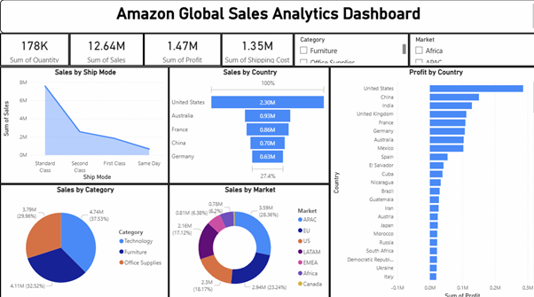

# Amazon Global Sales Analytics Dashboard

This project presents an **interactive Power BI dashboard** built using an ecommerce dataset containing global sales transactions.  
The objective of this project is to analyze sales performance, profitability, and market distribution to uncover business insights using **data visualization and business intelligence techniques**.

## Project Overview

This analytics project explores global ecommerce sales data to identify key trends in:

- Sales performance across countries and markets
- Product category performance
- Profit distribution
- Shipping modes and operational costs

The dashboard provides an **interactive view of business performance**, allowing stakeholders to quickly understand where revenue and profits are generated.

## Workshop & Certification

This dashboard project was developed as part of a **Data Analytics using Power BI workshop** conducted by **Tech Tip 24**.

The workshop focused on:

- Data visualization with Power BI
- Business KPI analysis
- Dashboard design and storytelling
- Interactive filtering and reporting

A certificate of participation is included in this repository.

## Dataset

The dataset contains transactional ecommerce data including:

- Order information
- Sales revenue
- Profit
- Shipping costs
- Product categories
- Markets and countries
- Shipping modes

Dataset file included in this repository:
data/ecomm_data.xlsx

## Dashboard Features

The Power BI dashboard includes the following analytical views:

### Key Performance Indicators (KPIs)

- Total Quantity Sold
- Total Sales Revenue
- Total Profit
- Total Shipping Cost

### Sales by Ship Mode

Visualizes how different shipping methods contribute to overall sales.

Shipping modes include:

- Standard Class
- Second Class
- First Class
- Same Day

### Sales by Country

Highlights the countries generating the highest revenue.

Key markets include:

- United States
- Australia
- France
- China
- Germany

### Profit by Country

Shows which countries generate the highest profits, helping identify high-performing markets.

### Sales by Market

Displays the distribution of sales across global markets such as:

- APAC
- EU
- US
- LATAM
- EMEA
- Africa
- Canada

## Dashboard Preview

## Key Business Insights

Some insights derived from the analysis include:

- The **United States generates the highest sales revenue** among all countries.
- **Technology products contribute the largest share of sales**.
- **Standard Class shipping dominates overall sales volume**.
- APAC and EU markets contribute significantly to global sales.
- Profitability varies significantly across different regions.

## Tools Used

- **Power BI** — dashboard creation and visualization
- **Microsoft Excel** — data storage and preprocessing
- **Business Intelligence Techniques** — exploratory analysis and insights generation

## How to Use

1. Download the repository.
2. Open the dashboard file:
   dashboard/amazon_sales_dashboard.pbix
3. Launch using **Microsoft Power BI Desktop** to explore the interactive visuals.

## Future Improvements

Potential improvements to this project include:

- Adding time-series analysis for sales trends
- Building predictive models for demand forecasting
- Integrating additional ecommerce datasets
- Deploying the dashboard to Power BI Service for web access

## Certification

Certificate of completion from the **Data Analytics using Power BI workshop** is available here:

certificates/oppo_powerbi_workshop_certificate.pdf

## Author

**Sowdeshwar Survesha Kumaar**

Master of Data Science  
University of Queensland

